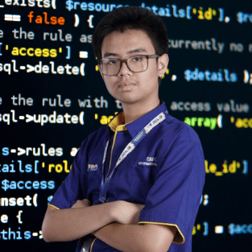

# Hi there, I'm Madyan Arashy 👋

  

I'm a web developer with a passion for creating efficient and user-friendly web applications. I have experience in both front-end and back-end technologies, which allows me to build seamless and dynamic web experiences. 

# :computer: Tech Stack:
      
<!---  --->
 
 

# Github Statistic

## 📫 Let's Connect

I'm always open to collaborating on exciting projects or just having a chat about web development. Feel free to reach out!

- [LinkedIn](#)
- [Email](mailto:madyan.arashy5@smk.belajar.id)

Thanks for stopping by!
